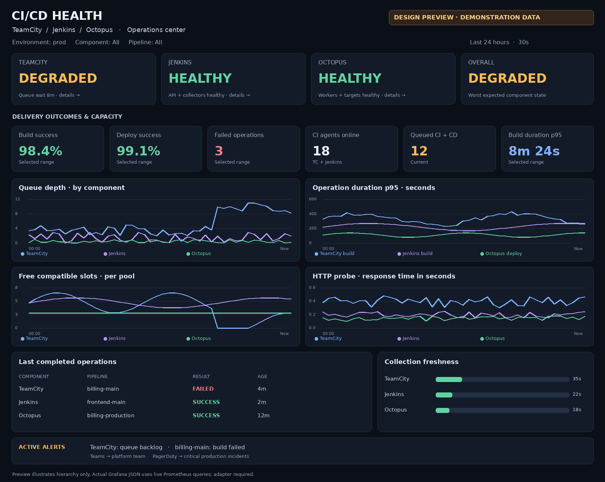

# CI/CD Health — Grafana

Комплект мониторинга TeamCity, Jenkins и Octopus: общий operational dashboard, конфигурации сбора, recording rules и Grafana Alerting.

## Файлы

- [Запрос в DevOps по настройке Prometheus и Kubernetes](docs/devops-cicd-monitoring-request.docx)
- [Пошаговая инструкция внедрения](cicd-health/README-RU.md)
- [Grafana Dashboard JSON](cicd-health/cicd-health-dashboard.json)
- [Правила Grafana Alerting](cicd-health/grafana-alert-rules.yml)
- [Prometheus recording rules](cicd-health/prometheus-recording-rules.yml)
- [Пример Prometheus scrape](cicd-health/prometheus-scrape.example.yml)
- [Пример Blackbox Exporter](cicd-health/blackbox.example.yml)
- [Пример Grafana datasource](cicd-health/grafana-datasource.example.yml)
- [Контракт нормализующего адаптера](cicd-health/METRICS-CONTRACT.md)
- [Архив комплекта](cicd-health-grafana-kit.zip)

## Подключение

1. Настроить адреса, авторизацию и сбор штатных метрик TeamCity/Jenkins.
2. Реализовать адаптер по контракту `ci_*` для общего обзора и Octopus. Код адаптера в комплект не входит.
3. Подключить HTTP-проверки и recording rules.
4. Импортировать dashboard JSON в Grafana и выбрать Prometheus datasource.
5. Настроить Grafana Alerting, Teams/PagerDuty и провести сценарии приёмки из инструкции.

Это шаблон, не развёрнутая система. JSON/YAML проверены структурно; импорт в работающую Grafana и выполнение PromQL требуют проверки в целевой инфраструктуре. Превью содержит демонстрационные значения, dashboard JSON — только запросы к реальным источникам.
